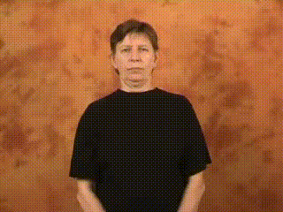
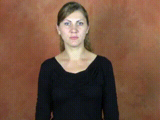
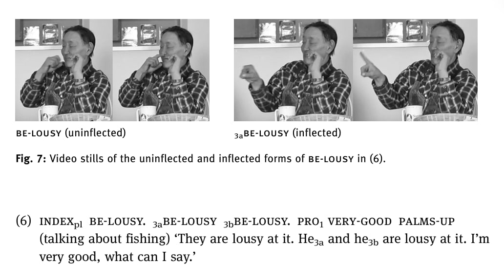

Особенности жестовых языков и связанные с ними трудности
========================================================

1: Высокая степень интерференции.
---------------------------------

ЖЯ подвержены сильной интерференции со стороны звучащих языков. В частности, это выражается в калькировании и заимствовании показателей, например.:

\
(1) `1SG  ТЕМПЕРАТУРА  ПОВЫШАТЬСЯ`\
'У меня высокая температура.'

\
(2) `У₂ₛ  ТЕМПЕРАТУРА  ПОВЫШАТЬСЯ`\
'У тебя высокая температура.'

Заметим, что в (2) используется жест Уₓ (< рус. _у_), употребляемый относительно регулярно некоторыми носителями в конструкциях обладания, практически свободно заменяющийся на соответствующий жест-индекс (1). Интерференция часто заметна в наличии/отсутствии адлогов, изменении порядка слов, отсутствии характерных для жестового языка морфологических явлений (см. следующие пункты): так, например, может использоваться или опускать адлог ОБ при глаголе ДОЛГО_ДУМАТЬ:

(3)* `п-е-т-я  INDEX₃ₐ  м-а-ш-а  (ОБ)  ДОЛГО_ДУМАТЬ`\

Стоит отметить, что подобный "средний" регистр часто возникает в ситуации общения глухих и слышащих. Следовательно, необходимо задуматься о дизайне опроса (_язык-посредник? наличие иллюстративного материала?_) и о количестве собираемых данных.

2: Типы глаголов
----------------

Традиционно среди НЕклассификаторных глаголов в ЖЯ выделяются _простые_ (несогласующиеся) и _согласующиеся_: у последних в зависимости от лица-числа A и P изменяются локализация, движение или (реже) форма руки. Например, рассмотрим жест СПРАШИВАТЬ (изменение движения):

\
(ж) `УНИВЕРСИТЕТ^ЛЮДИₐ  СПРАШИВАТЬ₃ₚ.ₐ`\
'Спроси у (других) студентов.'

\
(к) `СПРАШИВАТЬ₁`\
'Спроси у меня.'

На мой взгляд, согласование также представлять интерес для исследования. Во-первых, оно является морфологическим показателем, выражающим отношение между участниками (особенно при условии, что именное словоизменение в ЖЯ достаточно ограничено). Во-вторых, это интересно для лексической типологии: например, мы НЕ ожидаем, что глаголы-состояния объектов (если они не связаны с перемещением) будут согласовываться, что скорее верно — но встречаются контрпримеры:

\
[(Jepsen et al. 2015)](http://library.oapen.org/handle/20.500.12657/23905)

Отмечу, что тип глагола является лексической информацией, которая обычно не отражается в словарях. Особенно осложняет ситуация то, что наиболее часто противопоставлены именно _первое_ и _непервое_ лица. ___Возможно, нужна отдельная анкета на глаголы?___

3: Классификаторные конструкции
-------------------------------

Под __классификаторами__ будем понимать иконические жестовые единицы, не являющиеся частью лексикона носителя и формируемые в момент речи по определённым паттернам. Так, принято выделять такие группы классификаторов как _семантические_ (прямоходящая сущность, транспорт, животное), классификаторы _размера и формы_, _инструмента_, _части тела_ (части тела ассоциированы с конечностями, головой, глазами и т.п.) и _всего тела_ (тело пользователя отражает одушевлённую сущность).

Возможно, придётся рассматривать их как отдельный паттерн. Например, рассмотрим _сконструированный_ пример:

()* `ГОРОД  INDEX₃ₐ  CLF(ограда).ОКРУЖАТЬₐ`\
'Город окружён стеной.'

В этом случае вместо собственно жеста СТЕНА можно ожидать классификаторную конструкцию. Есть и примеры явной делексификации, при которой лексический жест приобретает свойства классификатора:

(4)\
`RH:          ДЕРЕВО.ПАДАТЬ `\
`LH:  CLF(машина)___________`\
'Дерево упало на машину.'

Жест ДЕРЕВО употребляется в неканоническом виде: перемещение руки в пространстве иконически отражает падение дерева. Так, возникает вопрос о классификации подобных конструкций в анкете.

4: Нелинейность.
----------------

В ЖЯ, в отличие от звуковых языков, продуктивно используются два артикулятора (правая и левая руки). Например, сочетание классификаторной конструкции с лексическими жестами показано в (3):

\
(3)\
`RH:  CLF(человек).ВСТАТЬ_ЗА  БАБУШКА  CLF(человек).встать_за______________________________`\
`LH:  CLF(человек)___________________________________________  ДОЧЬ  CLF(человек).ВСТАТЬ_ЗА`\
(Из "Репки") 'Бабка за деда, внучка за бабку.'

Отметим, что границы клауз проходят перед жестами БАБУШКА и ДОЧЬ соответственно, что, однако, не влияет на жест в другой руке. Достаточно регулярно вспомогательная рука (для правшей — левая) используется и в жесте-удержании.

См. _сконструированный_ пример (4):

(5)*\
`RH:  МУЖЧИНА  INDEX₃ₐ  КРАСИВЫЙ`\
`LH:           INDEX₃ₐ__________`\
'Тот мужчина красивый.'

Таким образом, перед нами встаёт задача определения способа записи
